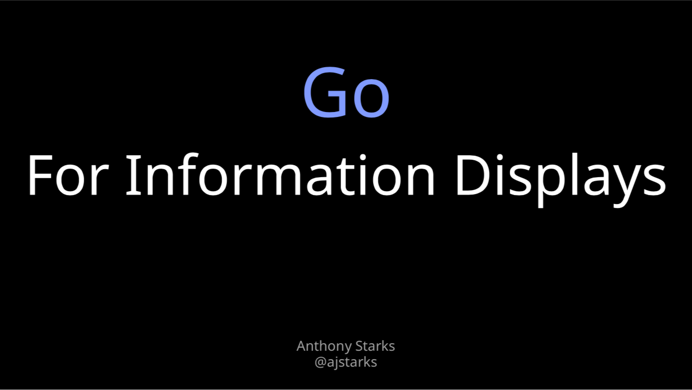

# Go for Information Displays


## Introduction

The story of using Go to make _Information Displays_: "An interesting arrangement
of text and graphics designed to inform".  The story is conveyed through
three Go packages: [SVGo](https://github.com/ajstarks/svgo) (generating SVG), [OpenVG](https://github.com/ajstarks/openvg), (wrapper to the OpenVG library on the Raspberry Pi) and [Deck](https://github.com/ajstarks/deck) (a package for presentations).

## Colophon

This deck uses [Noto Sans, Noto Mono, and Noto Serif](https://en.wikipedia.org/wiki/Noto_fonts).

This command line to generates the deck:

	$ ./mkdeck

The command can also make variations using	
[Fira Sans, Fira Mono](https://en.wikipedia.org/wiki/Fira_Sans) and 
[Bitstream Charter](https://en.wikipedia.org/wiki/Bitstream_Charter) 
or the [Go fonts](https://blog.golang.org/go-fonts) and Charter.

	$ ./mkdeck fira
	$ ./mkdeck go

You can also generate the deck with this command using [pdfdeck](https://github.com/ajstarks/deck/tree/master/cmd/pdfdeck):

	$ pdfdeck -pagesize 1920,1080 -sans NotoSans-Regular -mono NotoMono-Regular -serif NotoSerif-Regular goinfo.xml

The fonts are stored in $DECKFONTS, generated from TrueType files with the ```makefont``` utility 
from the [gofpdf](https://github.com/jung-kurt/gofpdf) package.

	$ cd $DECKFONTS
	$ makefont -embed /path/to/ttf-file
	

