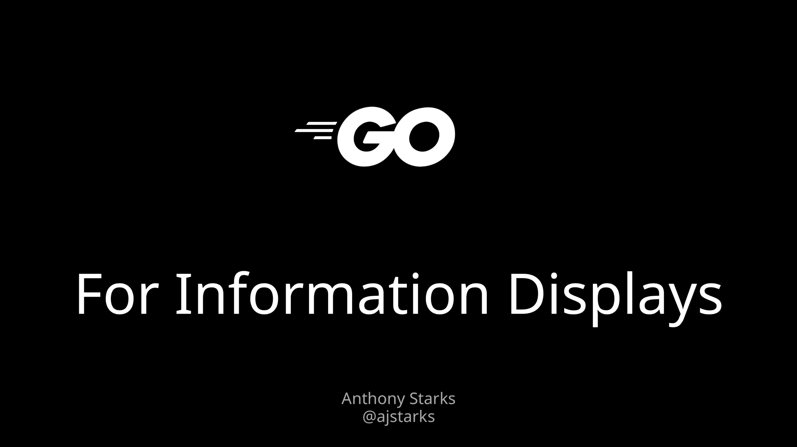

# Go for Information Displays


## Colophon

This deck uses [Noto Sans, Noto Mono, and Noto Serif](https://en.wikipedia.org/wiki/Noto_fonts).

The command line to generate the deck

	$ ./mkdeck
	
can generate the deck for [Fira Sans, Fira Mono](https://en.wikipedia.org/wiki/Fira_Sans) and 
[Bitstream Charter](https://en.wikipedia.org/wiki/Bitstream_Charter), or 
the [Go fonts](https://blog.golang.org/go-fonts) and Charter.

You can also generate the deck with this command:

	$ pdfdeck -pagesize 1920,1080 -sans NotoSans-Regular -mono NotoMono-Regular -serif NotoSerif-Regular  goinfo.xml

The fonts are stored in $DECKFONTS, generated from TrueType files with the ```makefont``` utility 
from the [gofpdf](https://github.com/jung-kurt/gofpdf) package.

	$ cd $DECKFONTS
	$ makefont -embed /path/to/ttf-file
	

